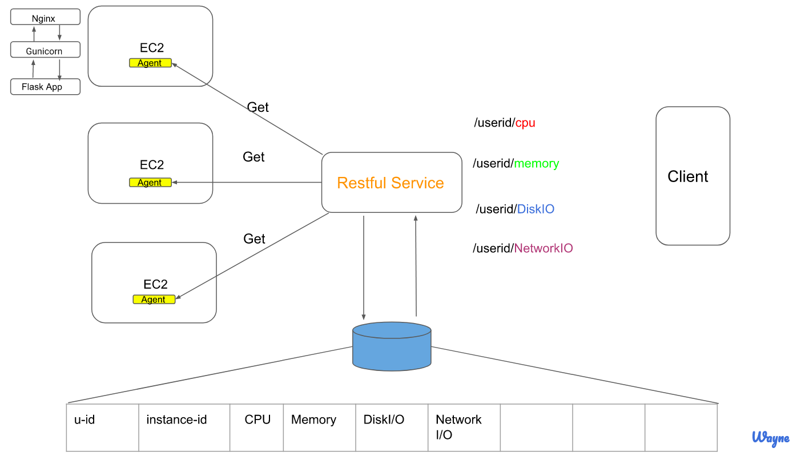

# How to run Flask App on EC2

You will only need your python code. you don't need entire folder for the app

## Getting started

On AWS ubuntu ec2 environment (It is not working after setting up linux so I change it to using ubuntu and follow up video for setting up the environment: https://www.youtube.com/watch?v=kDRRtPO0YPA&t=561s)

Step 1. Bring EC2 ubuntu up. 

Step 2. Go to this ec2 instance's security group to open port http 80(check security inbound rules)

Step 3. Ssh to AWS using terminal(You need to know where is your pem file store)  
  $ sudo ssh -i path/monitoringTool.pem ubuntu@ec2-107-22-36-197.compute-1.amazonaws.com

Step 4. after your are in EC2.  
$sudo apt-get update  
$sudo apt-get install python-pip nginx

Step 5. configure nginx (It is going to act like proxy server)  
		$ sudo /etc/init.d/nginx start
		$ sudo rm /etc/nginx/sites-enabled/default
		$ sudo touch /etc/nginx/sites-available/flask_settings
		$ sudo ln -s /etc/nginx/sites-available/flask_settings /etc/nginx/sites-enabled/flask_settings
				-if you see ln: failed to create symbolic link '/etc/nginx/sites-available/flask_settings': File exists
				-try to unlink this first: sudo unlink /etc/nginx/sites-available/flask_settings
				-if it still doesn't work. You can skip this step
		$ sudo vi /etc/nginx/sites-available/flask_settings
			server {

       			 location / {
             		   proxy_pass http://127.0.0.1:8000;
        			}

			}
			
		- exit file using esc -> ":x"
Step 6. Restart nginx
		$ sudo /etc/init.d/nginx restart
Step 7. install virtualenv
		$ pip install virtualenv
Step 8. make your flask app a directory
		$ mkdir my_flask_app
		
Step 9. cd to your flask app
		$ cd my_flask_app
Step 10. create a virtual environment in this directory
		$ virtualenv env
Step 11. activate it(must do)
		$ source env/bin/activate
Step 12. install flak and gunicorn
		$ pip install flask gunicorn
Step 13. install the library you need. EX: psutil
		$ pip install psutil
Step 14. create your app now
		$touch info.py
		$vi info.py
		past the code to this file

import os
import psutil
from flask import Flask
from flask import jsonify
app = Flask(__name__)

@app.route("/")
def index():
        return 'cpu use:'

@app.route("/cpu")
def cpu():
        cpuUse = psutil.cpu_percent(interval=1)
        print('cpu use:', cpuUse)
        return jsonify(
               cpuUse = cpuUse
        )
        # return 'cpu use:'+str(cpuUse)

#MemoroyUse
@app.route("/memory")
def memory():
        memoryUse = psutil.virtual_memory().percent
        print('memory use:', memoryUse)
        return jsonify(
                memoryUse = memoryUse
               )

#DiskUsageReadCount
@app.route("/diskUseReadCount")
def diskRead():
        diskUseReadCount = psutil.disk_io_counters(perdisk=False)[0]
        print('diskUse Read Count:', diskUseReadCount)
        return jsonify(
                diskUseReadCount = diskUseReadCount
                )
                
Step 14 run the app using gunicorn. info is your python file name. app is fix name
	$gunicorn info:app
	
	
	
--------------------------------Finished/Success-----------------------------------------(below is fail steps during the project)
	

on AWS linux centOS ec2 environment (challenge I faced. centOS environment is hard to set up uwsqi, because most of the online tutorial all using ubuntu.I follow the same thing they do on my linux environment. 
I doesn't work. So I change it to using ubuntu. 

1. sudo yum install python-pip  or wget https://bootstrap.pypa.io/get-pip.py -O - | python
2. sudo yum install gcc python-dev python-pip
   sudo pip install psutil
   sudo pip install flask
  
3.
  $ export FLASK_APP=info.py   (script name)
  $ flask run
  
4. After you run in on EC2, you can check the restful api internally by using
curl http://127.0.0.1:5000/diskUseReadCount

-------------------------------------------for external access. You should skip 3 and 4 and do step 5
5.  install web server on ec2 
    reference: https://www.matthealy.com.au/blog/post/deploying-flask-to-amazon-web-services-ec2/

5.1
	now, we need nginx to get request from outside and handle port 80
	[ec2-user@ip-172-31-6-157 ~]$ sudo yum install nginx
    [ec2-user@ip-172-31-6-157 ~]$ sudo vi /etc/nginx/nginx.conf
    Replace this line:  user  nginx; -> user  apps;(if you don't change root to user. you don't have to do this step)
    and in the http block: add this line:
    	server_names_hash_bucket_size 128;
5.2 And now let's define a server block for our site:
[ec2-user@ip-172-31-6-157 ~]$ sudo vi /etc/nginx/conf.d/virtual.conf

server {
    listen       80;
    server_name  your_public_dnsname_here;

    location / {
        proxy_pass http://127.0.0.1:5000;
    }
}

5.3 Start the nginx web server
     sudo /etc/rc.d/init.d/nginx start
     

----not sure below

*info is your webapp python name
6.[ec2-user@ip-172-31-43-34 ~]$ gunicorn info:app -b localhost:8000 &

6.setting up WSGI because it is a bridge between nginx and flask framework
6.1 sudo yum install mod_wsgi-python27.x86_64

6. setting up uwsqi

 6.1 $vi app.yaml
      past this to the file: 
       uwsgi:
         socket: 127.0.0.1:10080
      	 master: 1
  		 workers: 1
  		 chmod-socket: 666
  		 auto-procname: 1
  		 python-path: .
  		 pidfile: /tmp/uwsgi.pid
  	     daemonize: /var/log/uwsgi.log
  		 module: hello:app
 6.1 $sudo pip install uwsgi

    

  
  
  
  
  
4. on EC2 set security group (open port for)8080
  

  
  

